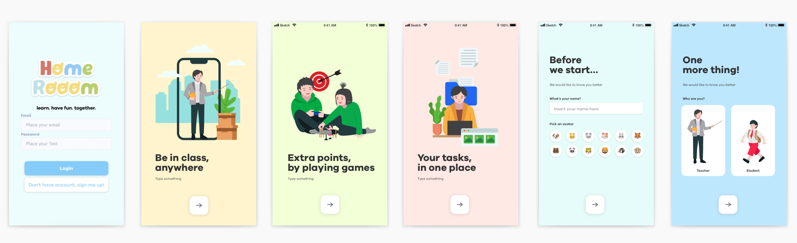
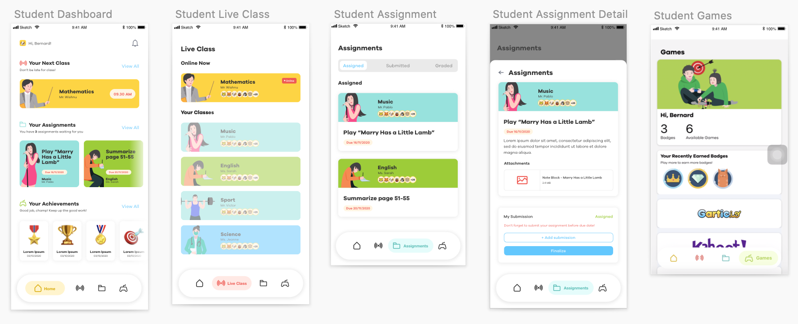

# Homerooom

> 🏆🏅🏆 Third Place Winner at BIOS 2020 Hackathon by Universitas Multimedia Nusantara 🏆🏅🏆

### 💡 About the App
Homerooom is an all-in-one mobile app solution for online learning. This app is made to tackle the issues found during COVID-19, where schools have a hard time to adjust with the WFH (work from home) situation.

Senior teachers have a hard time adjusting to multiple online platforms (ex: Zoom, Classroom, Form, Google Drive, etc). Students, especially in primary school, have a hard time keeping track of assignments and video conference links from every subject teachers. Lastly, students tend to have a hard time to focus or being engaged in online class, due to the lack of physical presence and interactions.

Therefore, Homerooom is built for students and teachers to have one app to do video conference, remind deadlines and submit assignments.

Another approach to increase engagement is to make games related to the subject readily available in the platform. Teacher can select games made in the platform for students to play. Students can get high scores, play with friends, and can get badges for achieving in games, which can be used as bonus points for teacher to score.

### 👀 Preview

###### Onboarding Interface

When starting the app, user will be prompetd to sign in or sign up. When signing up, user will see an onboarding screen to get a grasp of Homerooom. User will then create their account, and specify their user type; as a student or teacher.

###### Student User Interface

Student will have a packed dashboard, filled with reminders for next class, assignments, and show achievements by badges. Student can also join Live Class, submit assignments, and play games directly from the platform.

###### Teacher User Interface

Teacher will have a more organized dashboard, where they can manage each of their classes separately. They can create and manage classes, assignments, invite student to class, and view individual students.

Teacher can start Live Class, and do a video conference directly from Homerooom. Teacher can also select games to play in class and give badges manually, if they want to.

### 👨🏻‍💻 Tech Stack
Homerooom is fully built with React Native, with Expo environment. Homerooom use Firebase for storing database and file storage.

